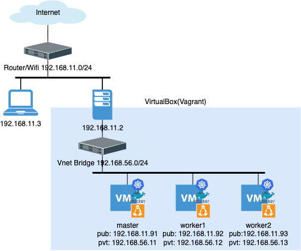

# Kubernetes in VirtualBox(Vagrant + Ansible)

masterノード1 + workerノード2でk8sクラスタが再現できる環境です。

## ネットワーク構成図



### カスタマイズポイント

* ご利用の環境に合わせてIPアドレスを変えたい方は `Vagrantfile` の`vmlist` によるアドレス定義と`ansible/hosts` および `ansible/group_vars/all.yml` をお好みで変えて下さい。
* k8s v1.28.2から、Vagrantの動作確認環境をMacからUbuntuに変えました。
  これに伴い Vagrantfile でブリッジに紐づけるネットワークインタフェース名を以下のように変えていますので、 `ip a` コマンドなどから適宜ご利用のものに変えてください。

```
$ git diff Vagrantfile
diff --git a/Vagrantfile b/Vagrantfile
index 9d02403..370681e 100644
--- a/Vagrantfile
+++ b/Vagrantfile
@@ -1,5 +1,4 @@
 box_os  = "generic/centos7"
-network_br = "en0: Ethernet 1"
 network_br = "enp87s0"
```

## 必要なもの

あらかじめ以下のツールを導入先ホストにインストールして下さい。

* 物理マシン (後述)
* Vagrant (2.4.0で確認)
* Ansible (core 2.15.8で動作確認)

## 物理マシン要件(最低)

* CPU: 6コア(1VMが2コア× 3VM もちろん仮想化技術に対応しているもの。Mなんちゃらとかはダメ)
* メモリ: 6GB (1VMが2GB × 3VM 正直余裕ない)
* ストレージ: 60GB (以下略)

上記はkubeadmの[導入要件](https://kubernetes.io/ja/docs/setup/production-environment/tools/kubeadm/install-kubeadm/)によるものです。  
もっといいスペックをお持ちのお金持ちの皆さんでスペックが許す限りworkerノードを増やしたい場合はVagrantfileとansible/hostsに加筆修正して下さい。  
なんだか面倒くさそうな方やいじって壊して直すことに面白みを感じない方、物理マシンが調達不能なほど貧乏な方はGKE, AKS, EKSといったクラウドサービスの無料枠を使って下さい。あるいはk3s, k3dなど軽量なk8sを使ってみるのもいいかもしれません。

## モチベーション

私も貧乏人なので某クラウドサービスのk8sを1週間ほど起動したまま放置してたら $60 ぶん取られてカッとなってやった。誰でも良かった。特に反省はしていない。

## インストールされるもの

常に最新版のk8sが導入可能なのが強み。  
あとぶっ壊したらもう一度作り直せばいいお手軽さ。

* CentOS 7.9.2009 (VM のOS)
* Kubernetes 1.28.2-0
* Flannel
* Docker 20.10.9-3
* Helm 3.7.2

## インストール

Vagrant, Ansibleをインストールしたホストから、本リポジトリのルートディレクトリに移動し、

```bash
$ vagrant up
```

以上。  
出来上がるまでなんの面白みの無い画面を眺めたりカップ麺にお湯を入れに行くなりしてしばらくお待ちください。

インストールが終わったら、

```bash
$ vagrant ssh master
```

で `kubectl` が叩けるマスターノードにログインできます。  
ホストから `kubectl` を使いたい場合はmasterノードのホームディレクトリの`.kube/config` をホストに持ってくるなどして使って下さい。(masterノードの接続先のIPアドレスはパブリックIPアドレスを使用して下さい。)

## 動作確認

k8sのシステム名前空間で動作しているPodが全てREADYであること。

```bash
$ kubectl get pods -n kube-system
NAME                             READY   STATUS    RESTARTS   AGE
coredns-5dd5756b68-26pp7         1/1     Running   0          10m
coredns-5dd5756b68-nkln4         1/1     Running   0          10m
etcd-master                      1/1     Running   0          10m
kube-apiserver-master            1/1     Running   0          10m
kube-controller-manager-master   1/1     Running   0          10m
kube-proxy-m8cb9                 1/1     Running   0          5m45s
kube-proxy-sfrl2                 1/1     Running   0          10m
kube-proxy-stkzb                 1/1     Running   0          64s
kube-scheduler-master            1/1     Running   0          10m
metrics-server-7f7fd6cb-99vc4    1/1     Running   0          10m
```

k8sのノードが全てREADYであること。

```bash
$ kubectl get node -o wide
NAME      STATUS   ROLES           AGE   VERSION   INTERNAL-IP     EXTERNAL-IP   OS-IMAGE                KERNEL-VERSION                 CONTAINER-RUNTIME
master    Ready    control-plane   29m   v1.28.2   192.168.56.11   <none>        CentOS Linux 7 (Core)   3.10.0-1160.105.1.el7.x86_64   containerd://1.6.26
worker1   Ready    <none>          24m   v1.28.2   192.168.56.12   <none>        CentOS Linux 7 (Core)   3.10.0-1160.105.1.el7.x86_64   containerd://1.6.26
worker2   Ready    <none>          19m   v1.28.2   192.168.56.13   <none>        CentOS Linux 7 (Core)   3.10.0-1160.105.1.el7.x86_64   containerd://1.6.26
```

**追記** k8s 1.24.0 よりコンテナラインタイムでdocker-shimのサポートが削除されたため、代わりにcontainerdを使用することになった。


## Future Releases(TODO)

気が向いたらやる。  

* プライベートレジストリ
* フロントエンド確認用のNGINX Ingress Controller
* Rookなどの分散ストレージ
* CentOSからUbuntuへ移行
* FlannelからCalicoへ移行 

