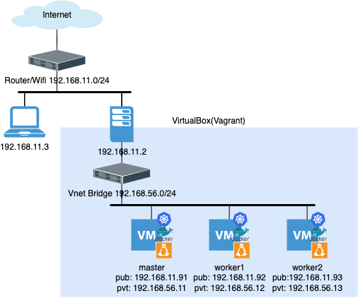

# Kubernetes in VirtualBox(Vagrant + Ansible)

masterノード1 + workerノード2でk8sクラスタが再現できる環境です。

## ネットワーク構成図



### カスタマイズポイント

* IPアドレスを変更したい場合は `Vagrantfile` の `vmlist` と `ansible/hosts` および `ansible/group_vars/all.yml` を編集してください。
* ブリッジに紐づけるネットワークインタフェース名は `Vagrantfile` の `network_br` で指定しています。  
  `ip a` コマンドなどでご利用の環境のインタフェース名を確認し、適宜変更してください。
* Kubernetes / Docker のバージョンは `ansible/group_vars/all.yml` で管理しています。
* VirtualBox + `ubuntu/jammy64` では、プライベートネットワーク側の NIC は `enp0s8` になります。  
  異なるボックスを使用する場合は `k8s_node_iface` および `flannel_iface` を変更してください。

## 必要なもの

あらかじめ以下のツールを導入先ホストにインストールして下さい。

* 物理マシン (後述)
* Vagrant (2.4.0 以降)
* Ansible (core 2.15 以降)
* VirtualBox

## 物理マシン要件(最低)

* CPU: 6コア(1VMが2コア × 3VM。仮想化技術に対応しているもの)
* メモリ: 6GB (1VMが2GB × 3VM)
* ストレージ: 60GB

上記はkubeadmの[導入要件](https://kubernetes.io/ja/docs/setup/production-environment/tools/kubeadm/install-kubeadm/)によるものです。  
スペックが許す限りworkerノードを増やしたい場合は `Vagrantfile` と `ansible/hosts` に加筆修正してください。  
物理マシンが用意できない場合は GKE, AKS, EKS などのクラウドサービスや k3s, k3d などの軽量 k8s もご検討ください。

## モチベーション

私も貧乏人なので某クラウドサービスのk8sを1週間ほど起動したまま放置してたら $60 ぶん取られてカッとなってやった。誰でも良かった。特に反省はしていない。

## インストールされるもの

* Ubuntu 22.04 LTS (ubuntu/jammy64)
* Kubernetes 1.36.x (kubeadm / kubelet / kubectl)
* Flannel (CNI)
* Docker CE (最新版)
* containerd (Docker CE に同梱)
* Helm 3 (最新版)
* Metrics Server (最新版)

## インストール

Vagrant, Ansible, VirtualBox をインストールしたホストから、本リポジトリのルートディレクトリに移動し、

```bash
vagrant up
```

以上。  
出来上がるまでなんの面白みのない画面を眺めたり、カップ麺にお湯を入れに行くなりしてしばらくお待ちください。

インストールが終わったら、

```bash
vagrant ssh master
```

で `kubectl` が叩けるマスターノードにログインできます。  
ホストから `kubectl` を使いたい場合は master ノードのホームディレクトリの `.kube/config` をホストに持ってくるなどして使って下さい。  
（接続先の IP アドレスはパブリック IP アドレスを使用してください。）

## 動作確認

k8s のシステム名前空間で動作している Pod が全て READY であること。

```bash
$ kubectl get pods -n kube-system
NAME                             READY   STATUS    RESTARTS   AGE
coredns-xxxxxxxxxx-xxxxx         1/1     Running   0          10m
coredns-xxxxxxxxxx-xxxxx         1/1     Running   0          10m
etcd-master                      1/1     Running   0          10m
kube-apiserver-master            1/1     Running   0          10m
kube-controller-manager-master   1/1     Running   0          10m
kube-proxy-xxxxx                 1/1     Running   0          5m
kube-proxy-xxxxx                 1/1     Running   0          10m
kube-proxy-xxxxx                 1/1     Running   0          64s
kube-scheduler-master            1/1     Running   0          10m
metrics-server-xxxxxxxxxx-xxxxx  1/1     Running   0          10m
```

k8s のノードが全て READY であること。

```bash
$ kubectl get node -o wide
NAME      STATUS   ROLES           AGE   VERSION   INTERNAL-IP     EXTERNAL-IP   OS-IMAGE             KERNEL-VERSION   CONTAINER-RUNTIME
master    Ready    control-plane   29m   v1.36.x   192.168.56.11   <none>        Ubuntu 22.04.x LTS   5.15.x-generic   containerd://x.x.x
worker1   Ready    <none>          24m   v1.36.x   192.168.56.12   <none>        Ubuntu 22.04.x LTS   5.15.x-generic   containerd://x.x.x
worker2   Ready    <none>          19m   v1.36.x   192.168.56.13   <none>        Ubuntu 22.04.x LTS   5.15.x-generic   containerd://x.x.x
```

## Kubernetes Dashboard (手動インストール)

Dashboard はリポジトリ URL が変動しやすいため、プロビジョニングには含めていません。  
[公式リポジトリ](https://github.com/kubernetes/dashboard) を参照し、最新の手順でインストールしてください。

```bash
# Helm を使った導入例 (URLは変更される場合があります)
helm repo add kubernetes-dashboard https://kubernetes.github.io/dashboard/
helm upgrade --install kubernetes-dashboard kubernetes-dashboard/kubernetes-dashboard \
  --create-namespace --namespace kubernetes-dashboard
```

## Future Releases (TODO)

気が向いたらやる。

* プライベートレジストリ
* フロントエンド確認用の NGINX Ingress Controller
* Rook などの分散ストレージ
* Flannel から Calico へ移行

---

## 更新履歴

| 日付 | バージョン | 変更内容 |
|------|-----------|---------|
| 2026-05-15 | k8s 1.36.1 | Kubernetes を 1.36.1 に更新 |
| 2026-05-15 | - | CentOS 7 → Ubuntu 22.04 LTS (ubuntu/jammy64) に移行 |
| 2026-05-15 | - | Kubernetes apt リポジトリを旧 Google リポジトリから pkgs.k8s.io に移行 |
| 2026-05-15 | - | Docker CE インストールを yum から apt に移行 |
| 2026-05-15 | - | containerd に SystemdCgroup 設定を追加 (k8s 1.24+ 対応) |
| 2026-05-15 | - | kubelet 設定を `/etc/sysconfig/kubelet` から `/etc/default/kubelet` に移行 |
| 2026-05-15 | - | Dashboard を Helm v3.x 対応に変更 (URL 変動のため手動インストールに移行) |
| 2026-05-15 | - | Flannel の `--iface` を変数 (`flannel_iface`) に変更 |
| 2024-xx-xx | k8s 1.28.2 | 動作確認環境を Mac から Ubuntu に変更、ブリッジ IF 名を `enp87s0` に変更 |
